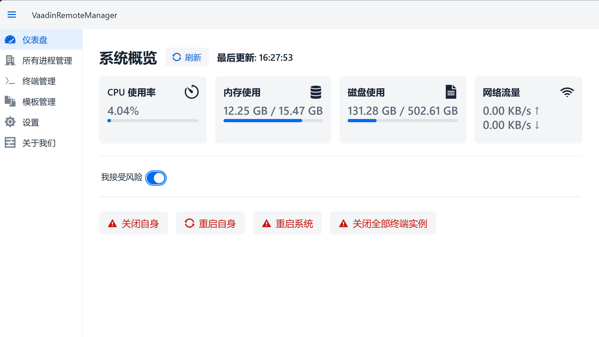
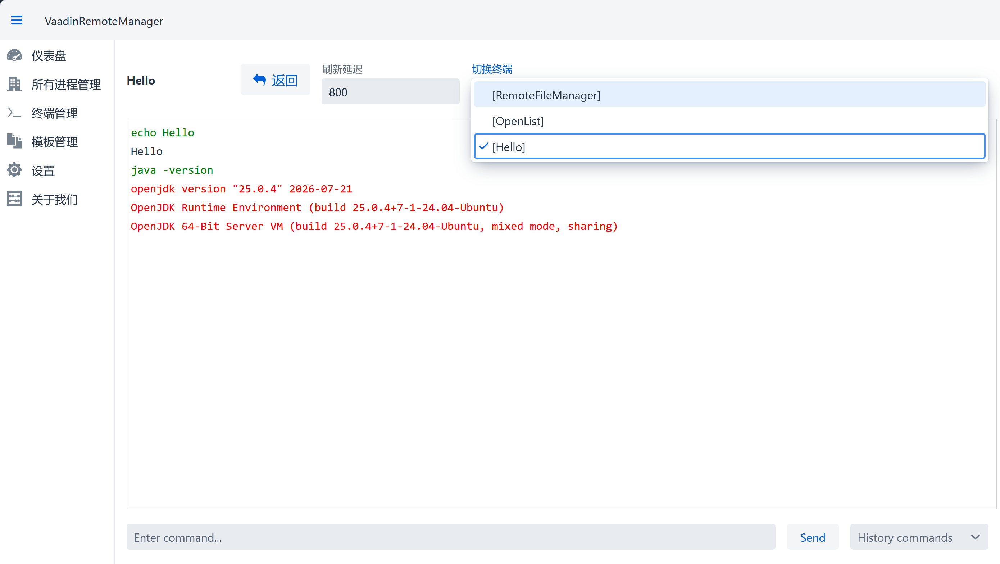
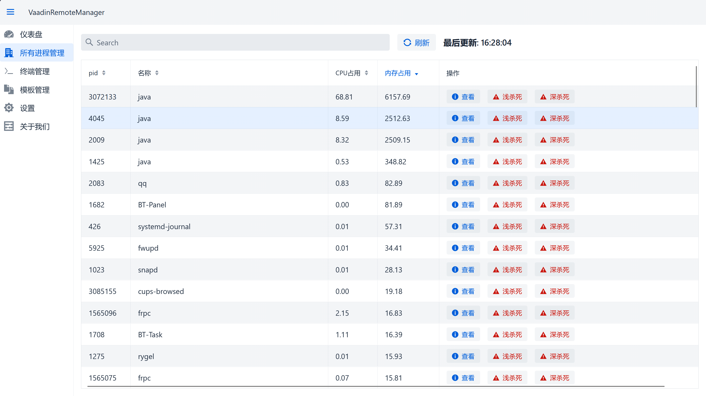
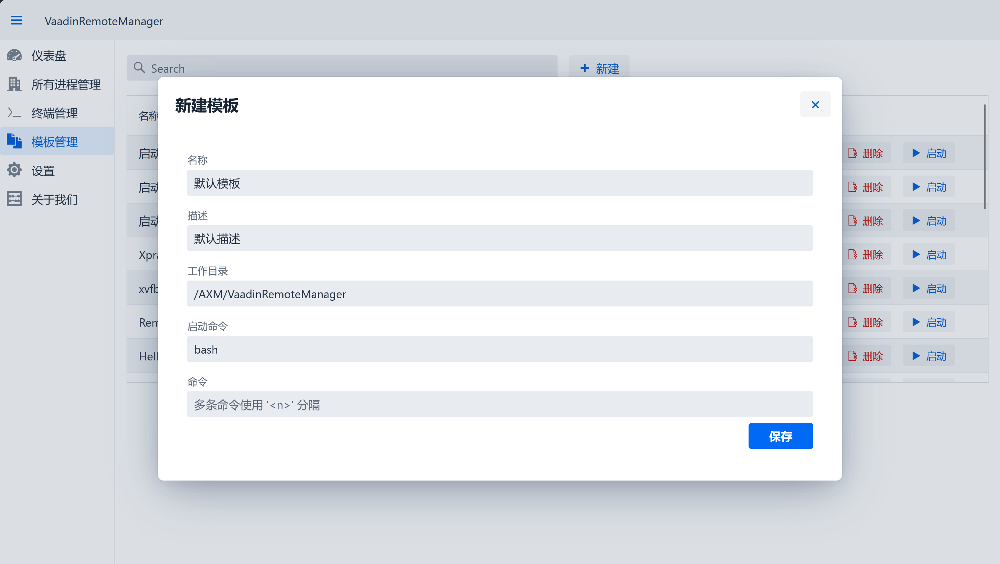
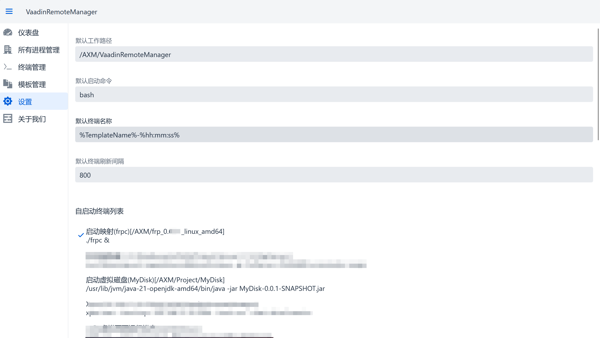

# VaadinRemoteManager

这是一个基于 `Vaadin` 的远程管理系统，主要用于简单的自启动终端配置、维护启动的终端、快捷终止进程、重启服务器等。


> 声明：此项目在`Vaadin 24.7.6`、`Java21`环境下开发，项目主要用于简单的远程管理，性能有限、旨在提供提供简易的Web管理页面以供受限的管理，当然你也可以基于这个项目分支修改去实现所需的功能。

## ⚙️ 功能概览
- **仪表盘**：实时查看系统状态、重启系统
- **进程管理**：查看和终止运行中的进程
- **终端管理**：创建、启动、停止远程终端会话、执行命令
- **模板管理**：保存模板，便于启动为终端
- **设置**：设置自启动模板（启动该程序后启动）

## 😄 运行

实现克隆仓库，执行如下命令第一次运行以初始化：

```sh
git clone git@github.com:AxolotlXMDev/VaadinRemoteManager.git
cd .\VaadinRemoteManager
mvn spring-boot:run
```
运行后会在`./data/auth.json`生成一个权限受限的实例账户，请修改密码和用户名，并且将权限改为`ADMIN`

最后,打开你的浏览器访问 http://localhost:8083 即可


## 🤩 效果预览
<p>主页(仪表盘)</p>
<p>终端管理</p>
<p>进程查看和管理</p>
<p>模板新建和管理</p>
<p>设置页</p>


## License

MIT © [AxolotlXMDev](./LICENSE)